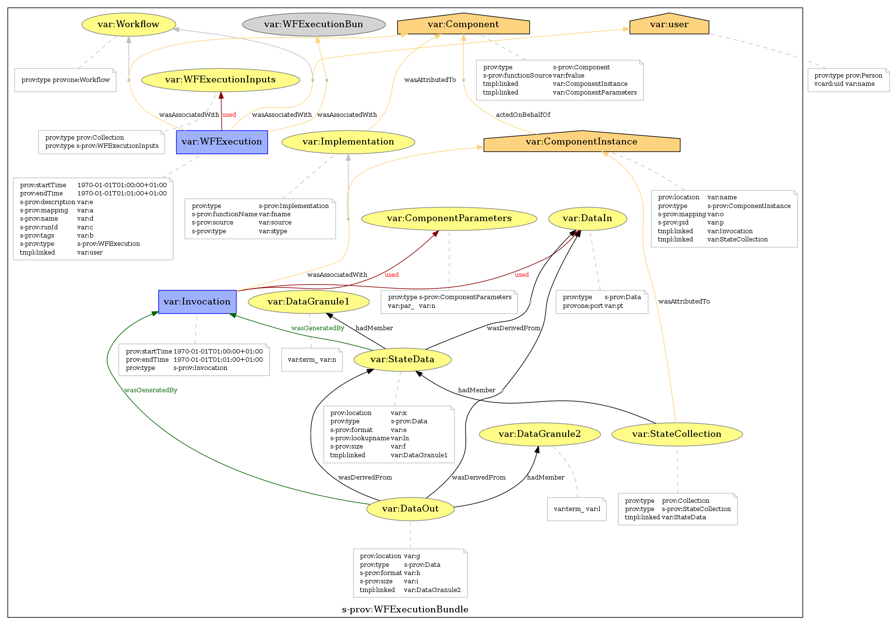
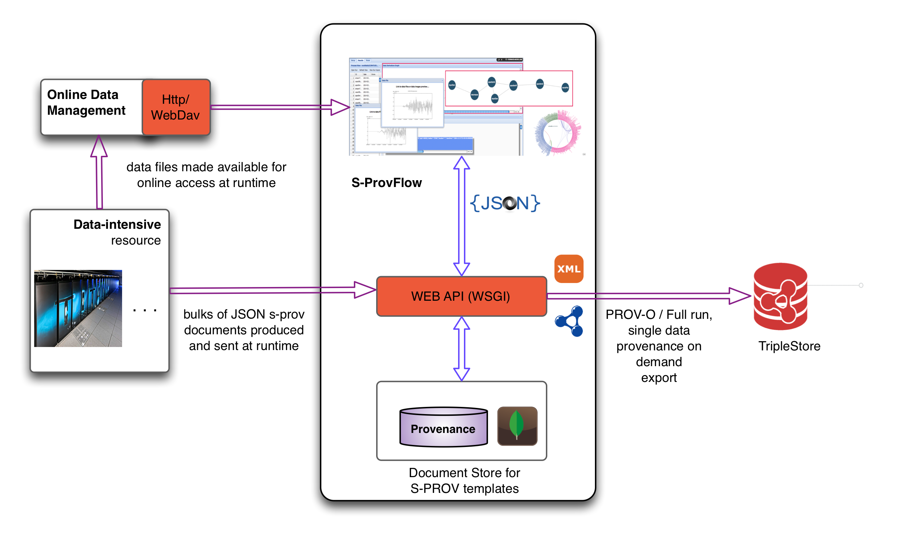
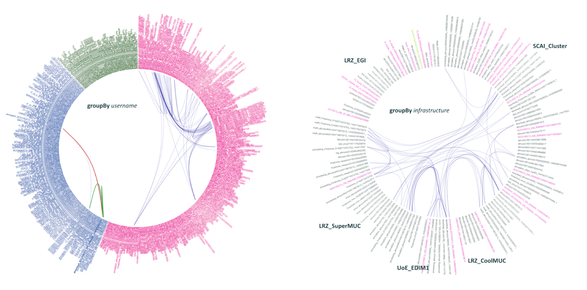

# S-ProvFlow

Provenance framework for storage and access of data-intensive streaming lineage. It offers a a web API and a range of dedicated visualisation tools based on the underlying provenance model, S-PROV, which utilises and extends PROV and ProvONE models. S-PROV addresses aspects of mapping between logical representation and concrete implementation of a workflow until its enactment onto a target computational resource.  The model captures aspects associated with the distribution of the computation, runtime changes and support for flexible metadata management and discovery for the data products generated by the execution of a data-intensive workflow.

     


- A collection of services including a WEB-API (provenance-api) and a front-end GUI (sprovflow-viewer) allowing acquisition and exploration of provenance data which is produced at a run-time by a computational engine. Below a schematic representation of the architecture and interaction with external resources, followed by screenshots of the interactive tools.

#### The API

S-ProvFlow system exposes a RESTful web API which offers high-level services on top of the storage backend. The API methods are classified in provenance acquisition, monitoring, data discovery and traceability, comprehensive-summaries, and provenance export. This is the service layer on top of which all the above visualisation and exploration tools are built. The API support the OpenAPI specs via the automatically generated [swagger 2.0](provenance-api/resources/swagger.json) description.

The API returns information in JSON and JSON-LD, which includes PROV and S-PROV semantics and references to external controlled vocabularies for the domain metadata describng the data entities and the agents participating in their production. It allows clients to selectively export provenance traces in PROV-XML and RDF for a single data results, as well as for the entire computation.



#### Monitoring and Validation Visualiser (MVV)

The S-ProvFlow system offers a visual tool (Monitoring and Validation Visualiser- MVV) that allows different sorts of operations through the interactive access and manipulation of the provenance information. These include monitoring of the progress of the execution with runtime indication on the production of data and the occurrence of errors, dependency navigation, data discovery, data preview, download and selective staging.


#### The Bulk Dependencies Visualiser (BDV)

The BVD produces comprehensive views for a single execution of a scientific data-intensive task or involving many runs and users. It exploits an approach to visual-analytics of the information captured that combines radial diagrams, selective grouping and Edge Bundles technique. Views of the provenance repository are generated interactively for multiple levels of granularity and for different kinds of expertise and roles. It offers facilities to tune and organise the views. 


We consider two classes of usage, respectively addressing details of a single computational tasks (above) or the interaction between user and their methods (below), according to configurable metadata properties and values-ranges.




#### Dockerization

The s-prov project can be deployed using docker technology. The project is split into a store and viewer instances.  The viewer is currently set to connect via the docker bridge to a local instance of the store. Changes to the docker file are required if the viewer is remote.
The store instance is deployable via docker-compose, the mongo db instance is split from the store services api. The store service can also be deployed independently so as to be attached to an existing mongo db. 

s-prov store,
  see **docker/store/docker-compose.yml**
```
  $ cd docker/store/
  $ docker-compose up --build 
```
s-prov viewer
```
   $ docker build docker/viewer/ -t viewer 
   $ docker run -it -p9000:8080 viewer 
```

